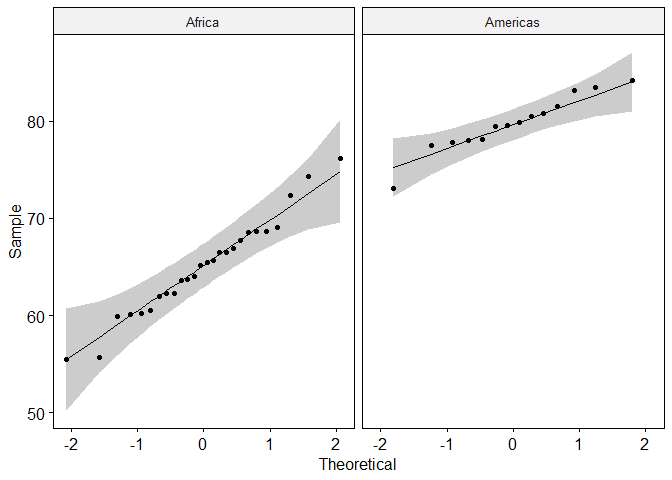
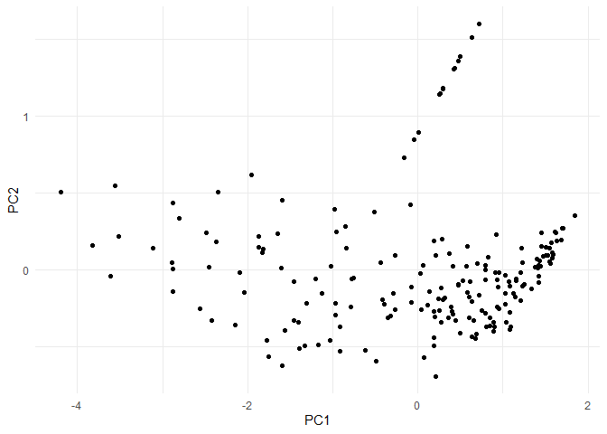

hw2
================
Elisaveta
2023-11-12

``` r
# Загрузим библиотеки
library(dplyr)
library(ggplot2)
theme_set(theme_minimal())
library(ggpubr)
library(plotly)
library(rstatix)
library(corrplot)
library(corrr)
library(GGally)
```

\#Task1

``` r
data <- readRDS("life_expectancy_data.RDS")
data <- data %>%
  rename_with(function(x) x %>% 
                stringi::stri_replace_all_regex(" ", "_", vectorize_all = FALSE))

summary(data)
```

    ##    Country               Year         Gender          Life_expectancy
    ##  Length:195         Min.   :2019   Length:195         Min.   :55.49  
    ##  Class :character   1st Qu.:2019   Class :character   1st Qu.:70.02  
    ##  Mode  :character   Median :2019   Mode  :character   Median :77.55  
    ##                     Mean   :2019                      Mean   :75.52  
    ##                     3rd Qu.:2019                      3rd Qu.:80.95  
    ##                     Max.   :2019                      Max.   :88.10  
    ##   Unemployment    Infant_Mortality      GDP                 GNI           
    ##  Min.   : 0.178   Min.   : 1.40    Min.   :1.884e+08   Min.   :3.754e+08  
    ##  1st Qu.: 3.735   1st Qu.: 5.35    1st Qu.:1.117e+10   1st Qu.:1.094e+10  
    ##  Median : 5.960   Median :13.50    Median :3.967e+10   Median :4.009e+10  
    ##  Mean   : 8.597   Mean   :19.61    Mean   :4.660e+11   Mean   :4.864e+11  
    ##  3rd Qu.:10.958   3rd Qu.:30.23    3rd Qu.:2.476e+11   3rd Qu.:2.457e+11  
    ##  Max.   :36.442   Max.   :75.80    Max.   :2.143e+13   Max.   :2.171e+13  
    ##  Clean_fuels_and_cooking_technologies   Per_Capita      
    ##  Min.   :  0.00                       Min.   :   228.2  
    ##  1st Qu.: 34.50                       1st Qu.:  2165.3  
    ##  Median : 80.70                       Median :  6624.8  
    ##  Mean   : 65.98                       Mean   : 16821.0  
    ##  3rd Qu.:100.00                       3rd Qu.: 19439.7  
    ##  Max.   :100.00                       Max.   :175813.9  
    ##  Mortality_caused_by_road_traffic_injury Tuberculosis_Incidence
    ##  Min.   : 0.00                           Min.   :  0.0         
    ##  1st Qu.: 8.20                           1st Qu.: 12.0         
    ##  Median :16.00                           Median : 46.0         
    ##  Mean   :17.06                           Mean   :103.8         
    ##  3rd Qu.:24.00                           3rd Qu.:138.5         
    ##  Max.   :64.60                           Max.   :654.0         
    ##  DPT_Immunization HepB3_Immunization Measles_Immunization Hospital_beds   
    ##  Min.   :35.00    Min.   :35.00      Min.   :37.00        Min.   : 0.200  
    ##  1st Qu.:85.69    1st Qu.:81.31      1st Qu.:84.85        1st Qu.: 1.301  
    ##  Median :92.00    Median :91.00      Median :92.00        Median : 2.570  
    ##  Mean   :87.99    Mean   :86.76      Mean   :87.31        Mean   : 2.997  
    ##  3rd Qu.:97.00    3rd Qu.:96.00      3rd Qu.:96.50        3rd Qu.: 3.773  
    ##  Max.   :99.00    Max.   :99.00      Max.   :99.00        Max.   :13.710  
    ##  Basic_sanitation_services Tuberculosis_treatment Urban_population
    ##  Min.   :  8.632           Min.   :  0.00         Min.   : 13.25  
    ##  1st Qu.: 62.919           1st Qu.: 73.00         1st Qu.: 41.92  
    ##  Median : 91.144           Median : 82.00         Median : 58.76  
    ##  Mean   : 77.380           Mean   : 77.57         Mean   : 59.12  
    ##  3rd Qu.: 98.582           3rd Qu.: 88.00         3rd Qu.: 78.02  
    ##  Max.   :100.000           Max.   :100.00         Max.   :100.00  
    ##  Rural_population Non-communicable_Mortality  Sucide_Rate        continent 
    ##  Min.   : 0.00    Min.   : 4.40              Min.   : 0.300   Africa  :52  
    ##  1st Qu.:21.98    1st Qu.:11.85              1st Qu.: 2.050   Americas:38  
    ##  Median :41.24    Median :17.20              Median : 3.500   Asia    :42  
    ##  Mean   :40.88    Mean   :17.05              Mean   : 4.802   Europe  :48  
    ##  3rd Qu.:58.08    3rd Qu.:22.10              3rd Qu.: 6.600   Oceania :15  
    ##  Max.   :86.75    Max.   :43.70              Max.   :30.100

\#Task2

``` r
plot_ly(
  data = data,
  x = ~Life_expectancy,
  y = ~Tuberculosis_Incidence,
  color = ~continent,
  type = 'scatter'
)   %>%
  layout(
    title = 'Отношение ожидаемой продолжительности жизни и заболеваемости туберкулезом',
    yaxis = list(title = 'Заболеваемость туберкулезом'),
    xaxis = list(title = 'Ожидаемая продолжительность жизни')) 
```

\#Task3

``` r
shapiro.test(data$Life_expectancy[data$continent == "Africa"])
```

    ## 
    ##  Shapiro-Wilk normality test
    ## 
    ## data:  data$Life_expectancy[data$continent == "Africa"]
    ## W = 0.96577, p-value = 0.1392

``` r
shapiro.test(data$Life_expectancy[data$continent == "Americas"])
```

    ## 
    ##  Shapiro-Wilk normality test
    ## 
    ## data:  data$Life_expectancy[data$continent == "Americas"]
    ## W = 0.95049, p-value = 0.09241

``` r
ggqqplot(data[data$continent == c("Americas", "Africa")], 
         x = "Life_expectancy", facet.by = "continent")
```

    ## Warning in `==.default`(data$continent, c("Americas", "Africa")): длина
    ## большего объекта не является произведением длины меньшего объекта

    ## Warning in is.na(e1) | is.na(e2): длина большего объекта не является
    ## произведением длины меньшего объекта

<!-- -->

\#Task4

``` r
new_data <- data %>%
  select(where(is.numeric))

new_data <- subset(new_data, select = - c(1))

corrplot(cor(new_data), method = 'number')
```

<!-- -->

\#Task5

``` r
library(factoextra)

new_data_scaled <- scale(new_data)
new_data_dist<- dist(new_data_scaled, 
                        method = "euclidean"
                        )
as.matrix(new_data_dist)[1:6,1:6]
```

    ##          1        2        3        4        5        6
    ## 1 0.000000 7.605708 6.331840 4.414874 6.645623 7.923487
    ## 2 7.605708 0.000000 2.624659 7.921597 3.357361 3.631018
    ## 3 6.331840 2.624659 0.000000 6.321666 4.350331 3.464837
    ## 4 4.414874 7.921597 6.321666 0.000000 8.095849 7.161240
    ## 5 6.645623 3.357361 4.350331 8.095849 0.000000 4.966244
    ## 6 7.923487 3.631018 3.464837 7.161240 4.966244 0.000000

``` r
new_data_hc <- hclust(d = new_data_dist, 
                        method = "ward.D2")
fviz_dend(new_data_hc, 
          cex = 0.1)
```

    ## Warning: The `<scale>` argument of `guides()` cannot be `FALSE`. Use "none" instead as
    ## of ggplot2 3.3.4.
    ## ℹ The deprecated feature was likely used in the factoextra package.
    ##   Please report the issue at <https://github.com/kassambara/factoextra/issues>.
    ## This warning is displayed once every 8 hours.
    ## Call `lifecycle::last_lifecycle_warnings()` to see where this warning was
    ## generated.

<!-- --> \#Task6

``` r
library(ggfortify) 

autoplot(new_data_scaled)
```

    ## Scale for y is already present.
    ## Adding another scale for y, which will replace the existing scale.

<!-- -->

``` r
library(pheatmap)

pheatmap(new_data_scaled, 
         show_rownames = FALSE, 
         clustering_distance_rows = new_data_dist,
         clustering_method = "ward.D2", 
         cutree_rows = 5,
         cutree_cols = length(colnames(new_data_scaled)),
         angle_col = 45, 
         main = "Dendrograms for clustering rows and columns with heatmap")
```

<!-- --> Строки были
объедидены в 5 кластеров. Однородность проследивается по столбцам GDP и
GNI; Per_Capita для первого и второго кластера.

\#Task7

``` r
ggplot() +
  geom_point(data = new_data, aes(x = Life_expectancy, y = Infant_Mortality)) +
  theme_minimal()
```

<!-- -->

``` r
data_example <- new_data %>% 
  select(Life_expectancy, Infant_Mortality)

data_example <- data_example %>% 
  mutate(pc1 = Life_expectancy + Infant_Mortality)

data_example <- data_example %>% 
  mutate(pc2 = Life_expectancy - Infant_Mortality)

ggplot() +
  geom_point(data = data_example, aes(x = pc1, y = pc2)) +
  theme_minimal() 
```

<!-- -->

``` r
data_example <- data_example %>% 
  select(Life_expectancy, Infant_Mortality) 

data.pca <- prcomp(data_example, 
                scale = T)

data.pca$rotation
```

    ##                         PC1       PC2
    ## Life_expectancy   0.7071068 0.7071068
    ## Infant_Mortality -0.7071068 0.7071068

``` r
ggplot() +
  geom_point(data = data.pca$x,
             aes(x = PC1, y = PC2)) +
  theme_minimal()
```

<!-- -->

``` r
library(FactoMineR)
data_full.pca <- prcomp(new_data, 
                        scale = T)
summary(data_full.pca)
```

    ## Importance of components:
    ##                           PC1    PC2    PC3     PC4     PC5     PC6    PC7
    ## Standard deviation     2.7526 1.4841 1.3952 1.17177 1.08375 0.96347 0.9288
    ## Proportion of Variance 0.3988 0.1159 0.1025 0.07227 0.06182 0.04886 0.0454
    ## Cumulative Proportion  0.3988 0.5147 0.6172 0.68945 0.75126 0.80012 0.8455
    ##                            PC8     PC9    PC10    PC11    PC12    PC13    PC14
    ## Standard deviation     0.85740 0.69263 0.68937 0.59106 0.54986 0.47085 0.36596
    ## Proportion of Variance 0.03869 0.02525 0.02501 0.01839 0.01591 0.01167 0.00705
    ## Cumulative Proportion  0.88421 0.90946 0.93447 0.95286 0.96877 0.98044 0.98749
    ##                           PC15    PC16    PC17    PC18      PC19
    ## Standard deviation     0.34546 0.26941 0.20224 0.06968 1.017e-15
    ## Proportion of Variance 0.00628 0.00382 0.00215 0.00026 0.000e+00
    ## Cumulative Proportion  0.99377 0.99759 0.99974 1.00000 1.000e+00

``` r
fviz_eig(data_full.pca, addlabels = T, ylim = c(0, 40))
```

<!-- -->

``` r
fviz_pca_var(data_full.pca, col.var = "contrib")
```

<!-- -->

``` r
fviz_pca_var(data_full.pca, 
             select.var = list(contrib = 3), # Задаём число здесь 
             col.var = "contrib")
```

<!-- -->

``` r
fviz_contrib(data_full.pca, choice = "var", axes = 1, top = 24) # 1
```

<!-- -->

``` r
fviz_contrib(data_full.pca, choice = "var", axes = 2, top = 24) # 2
```

<!-- -->

``` r
fviz_contrib(data_full.pca, choice = "var", axes = 3, top = 24) # 3
```

<!-- --> Половина условой
вариации всех наблюдений объясняется первыми двумя компонентами. Первые
три главные компоненты объясняют 61,7%, что не самый оптимальный вариант
данных. Самые важные переменные с точки зрения их вариации в PC1 и PC2:
ожидаемая продолжительность жизни и иммунизация HepB3, DPT

\#Task8

``` r
library(ggbiplot)

ggbiplot(data_full.pca, 
         scale=0, alpha = 0.1) + 
  theme_minimal()

plot <- ggbiplot(data_full.pca, 
         scale=0, 
         groups = as.factor(data$continent), 
         ellipse = T,
         alpha = 0.2) +
  theme_minimal()

ggplotly(plot)
```

\#Task9 Для дальнейшего анализа, мы можем подумать об объединении
колонок иммунизации; взаимосвязи Tuberculosis_treatment и
Rural_population; Mortality_caused_by_road_traffic_injury и
Non-communicable_Mortality; Tuberculosis_Incidence и Infant_Mortality;
Per_Capita и Urban_population

\#Task10

``` r
library(tidymodels)
library(embed)

umap_prep <- recipe(~., data = new_data) %>% 
  step_normalize(all_predictors()) %>% 
  step_umap(all_predictors()) %>%  
  prep() %>%  
  juice() 

umap_prep %>%
  ggplot(aes(UMAP1, UMAP2)) + 
  geom_point(aes(color = as.character(data$continent),
                 shape = data$continent), 
             alpha = 0.7, size = 2) +
  labs(color = NULL)
```

<!-- --> Создается
ощущение, что точки отобращаются более группировано, но в то же время,
мы видим, что два получившихся “облака” не однородны по своему составу,
хотя в каждом превалирует определенные варианты континентов.

\#Task11

``` r
new_data1 <- subset(new_data, select = c(1:14))
data_full.pca1 <- prcomp(new_data1, 
                        scale = T)
summary(data_full.pca1)

fviz_eig(data_full.pca1, addlabels = T, ylim = c(0, 40))

fviz_pca_var(data_full.pca1, col.var = "contrib")

fviz_pca_var(data_full.pca1, 
             select.var = list(contrib = 3), # Задаём число здесь 
             col.var = "contrib")

fviz_contrib(data_full.pca1, choice = "var", axes = 1, top = 24) # 1
fviz_contrib(data_full.pca1, choice = "var", axes = 2, top = 24) # 2
fviz_contrib(data_full.pca1, choice = "var", axes = 3, top = 24) # 3
# После удаления последних 5-ти колонок первые три компоненты стали объяснять 70% вариации

ggbiplot(data_full.pca1, 
         scale=0, alpha = 0.1) + 
  theme_minimal()
```

``` r
new_data2 <- subset(new_data, select = c(6:19))
data_full.pca2 <- prcomp(new_data2, 
                        scale = T)
summary(data_full.pca2)

fviz_eig(data_full.pca2, addlabels = T, ylim = c(0, 40))

fviz_pca_var(data_full.pca2, col.var = "contrib")

fviz_pca_var(data_full.pca2, 
             select.var = list(contrib = 3), 
             col.var = "contrib")

fviz_contrib(data_full.pca2, choice = "var", axes = 1, top = 24) # 1
fviz_contrib(data_full.pca2, choice = "var", axes = 2, top = 24) # 2
fviz_contrib(data_full.pca2, choice = "var", axes = 3, top = 24) # 3
# После удаления первых 5-ти колонок первые три компоненты стали объяснять 67% вариации

ggbiplot(data_full.pca2, 
         scale=0, alpha = 0.1) + 
  theme_minimal()
```

``` r
new_data3 <- subset(new_data, select = -c(Unemployment, GDP, GNI, Sucide_Rate, Hospital_beds))
data_full.pca3 <- prcomp(new_data3, 
                        scale = T)
summary(data_full.pca3)

fviz_eig(data_full.pca3, addlabels = T, ylim = c(0, 40))

fviz_pca_var(data_full.pca3, col.var = "contrib")

fviz_pca_var(data_full.pca3, 
             select.var = list(contrib = 3), 
             col.var = "contrib")

fviz_contrib(data_full.pca3, choice = "var", axes = 1, top = 24) # 1
fviz_contrib(data_full.pca3, choice = "var", axes = 2, top = 24) # 2
fviz_contrib(data_full.pca3, choice = "var", axes = 3, top = 24) # 3
# После удаления неслучайных 5-ти колонок Unemployment, GDP, GNI, Sucide_Rate, Hospital_beds первые три компоненты стали объяснять 73% вариации, что пока наилучший результат

ggbiplot(data_full.pca3, 
         scale=0, alpha = 0.1) + 
  theme_minimal()
```

\#Task12

``` r
data2 <- data %>%
  mutate(is_Africa = ifelse(continent == "Africa", 1, 0),
         is_Oceania = ifelse(continent == "Oceania", 1, 0))
data2_num <- data2 %>% 
  select(where(is.numeric))

data_full.pca4 <- prcomp(data2_num, 
                        scale = T)

#Error in prcomp.default(data2_num, scale = T) :  не могу отмасштабировать постоянную/нулевую колонку с единичной дисперсией

#я так поминаю, что это из-за дамми-колонок, их стоило кодировать как-то иначе, не через 0 и 1?

summary(data_full.pca4)

fviz_eig(data_full.pca4, addlabels = T, ylim = c(0, 40))

fviz_pca_var(data_full.pca4, col.var = "contrib")

fviz_pca_var(data_full.pca4, 
             select.var = list(contrib = 3), 
             col.var = "contrib")

fviz_contrib(data_full.pca4, choice = "var", axes = 1, top = 24) # 1
fviz_contrib(data_full.pca4, choice = "var", axes = 2, top = 24) # 2
fviz_contrib(data_full.pca4, choice = "var", axes = 3, top = 24) # 3


ggbiplot(data_full.pca4, 
         scale=0, alpha = 0.1) + 
  theme_minimal()
```
